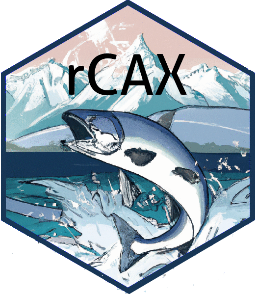

[](https://github.com/nwfsc-math-bio/rCAX/releases/latest)
[](https://github.com/nwfsc-math-bio/rCAX/actions/workflows/check-release.yaml)

rCAX 
========

`rCAX` is an R client for the [Coordinated Assessments API](https://www.streamnet.org/resources/exchange-tools/rest-api-documentation/). Coordinated Assessments data eXchange (CAX) is developed by the Coordinated Assessments Partnership (CAP). CAP is a collaborative process to efficiently share and provide access to standardized derived information, such as fish population-scale high-level indicators (HLIs) and supporting metrics. Participants in CAP include state fish and wildlife management agencies, tribes, federal agencies such as National Oceanic and Atmospheric Administration Fisheries (NOAA Fisheries) and Bonneville Power Administration (BPA), and others. CAP is co-sponsored by StreamNet and Pacific Northwest Aquatic Monitoring Partnership (PNAMP). Make sure to review the [StreamNet Terms of Use](https://nwfsc-math-bio.github.io/rCAX/articles/terms.html) for these data, the [StreamNet Data Policy](https://www.streamnet.org/resources/exchange-tools/data-agreements/) and the citation information from [StreamNet](https://www.streamnet.org/resources/citing-sn/) and [PNAMP](https://www.pnamp.org/project/data-citation-and-attribution) for database queries. *rCAX authors: Eli Holmes and Mari Williams, Northwest Fisheries Science Center, NOAA Fisheries.*

## Installation

Install the latest GitHub release. You only need to do this once.

```r
install.packages("remotes") # needed for the next line
remotes:::install_github("nwfsc-math-bio/rCAX@*release")
```

## Download a table

Read about the [CAX data and terms](https://nwfsc-math-bio.github.io/rCAX/articles/cax.html). Then read the [Basic functions vignette](https://nwfsc-math-bio.github.io/rCAX/articles/basics.html) to get started and see examples of how to make queries.

To retrieve the NOSA data for NMFS_popid 7 that is the same as the file that one can download from [CAP Fish HLIs Tabular Query](https://www.streamnet.org/data/hli/), use

```
library(rCAX)
f <- list(nmfs_popid=7)
tab <- rcax_hli("NOSA", flist = f)
```

### Check the versions

You can check your installed version versus that on GitHub at any time using `rcax_version()`.


## Contributing

Fork and put in a pull request!

## Contributors

[](https://github.com/nwfsc-math-bio/rCAX/graphs/contributors)


<hr>

## Credits

Thanks to the developers of [rredlist](https://github.com/ropensci/rredlist) package who created a package that was easy to use as a template for a REST API client with R. Some of the base functions in rCAX are directly derived from the rredlist packages (and this is noted in the function references).


### Disclaimer

This repository is a scientific product and is not official communication of the National Oceanic and Atmospheric Administration, or the United States Department of Commerce. All NOAA GitHub project content is provided on an "as is" basis and the user assumes responsibility for its use. Any claims against the Department of Commerce or Department of Commerce bureaus stemming from the use of this GitHub project will be governed by all applicable Federal law. Any reference to specific commercial products, processes, or services by service mark, trademark, manufacturer, or otherwise, does not constitute or imply their endorsement, recommendation or favoring by the Department of Commerce. The Department of Commerce seal and logo, or the seal and logo of a DOC bureau, shall not be used in any manner to imply endorsement of any commercial product or activity by DOC or the United States Government.

### License

This content was created by U.S. Government employees as part of their official duties. This content is not subject to copyright in the United States (17 U.S.C. §105) and is in the public domain within the United States of America. The rCAX package as a whole is distributed under [GNU GENERAL PUBLIC
LICENSE version 3](https://www.tldrlegal.com/license/gnu-general-public-license-v3-gpl-3) (GPL-3).


